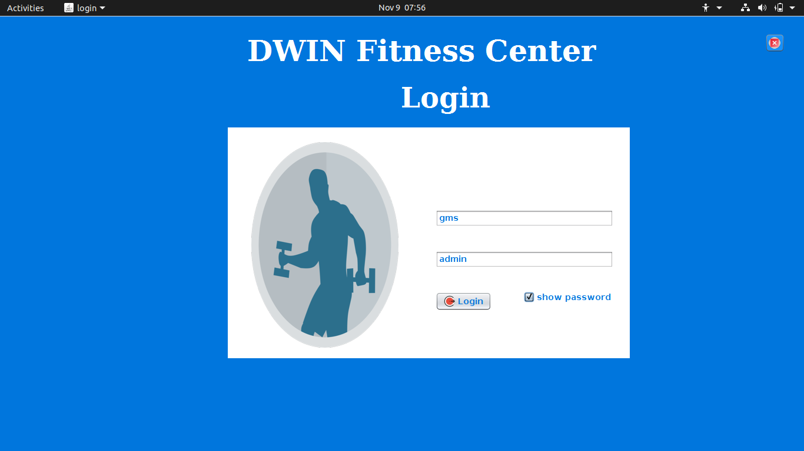
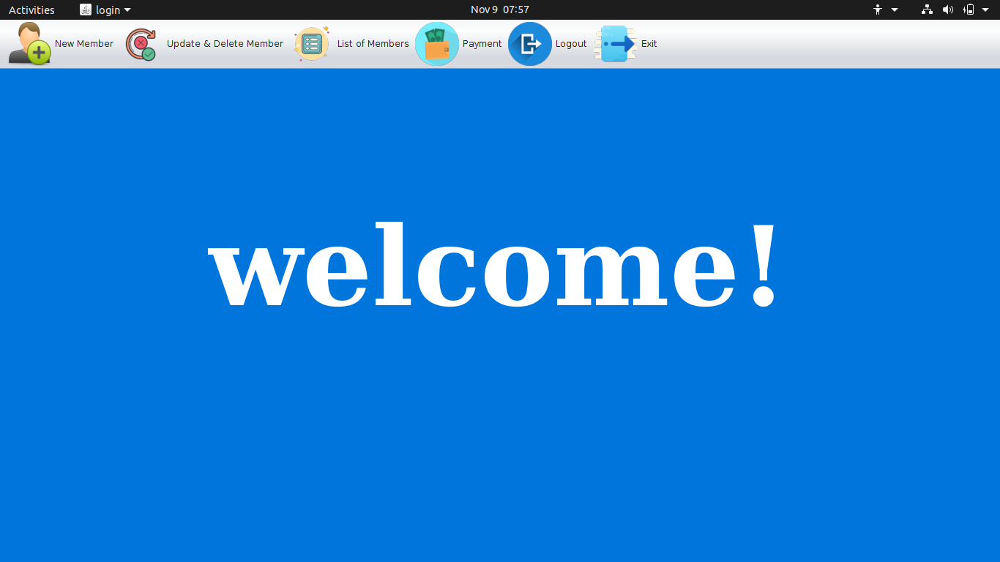
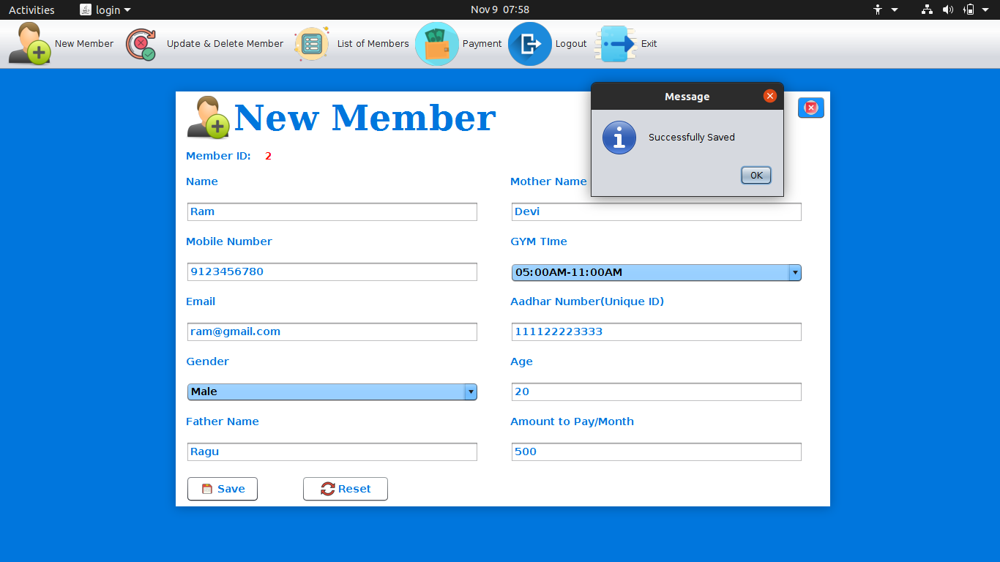
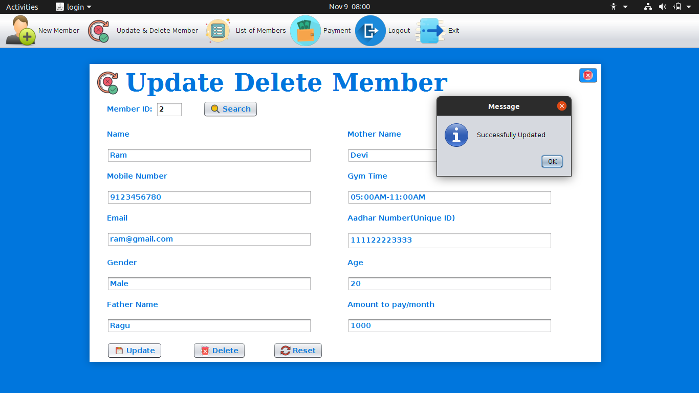
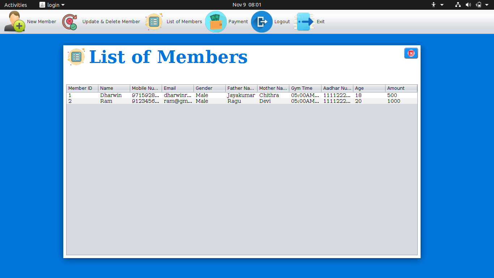
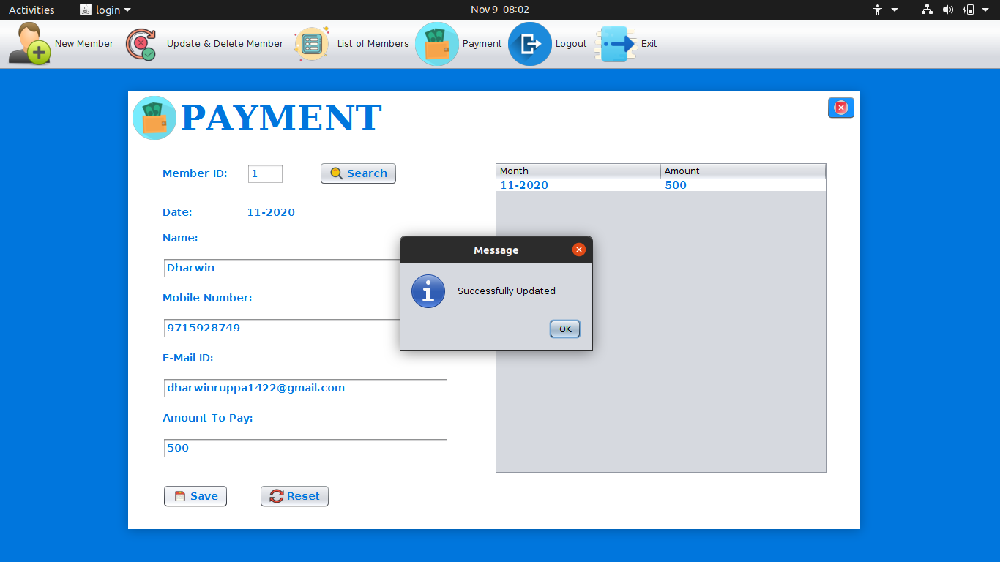
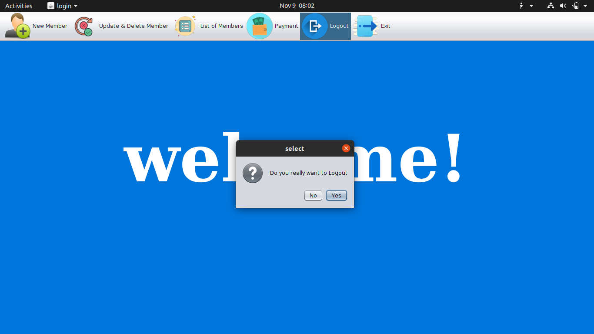

# gym-managment-system
## GYM Managment System using Java Swing and SQLite
## Video Demo: https://youtu.be/hnn98S4nY0A
## For running my Application in your Local Machine,
## [Download(.exe) and (.jar)](https://github.com/DharwinRVJ/gym-managment-system/raw/master/gym_managment_system.zip)

